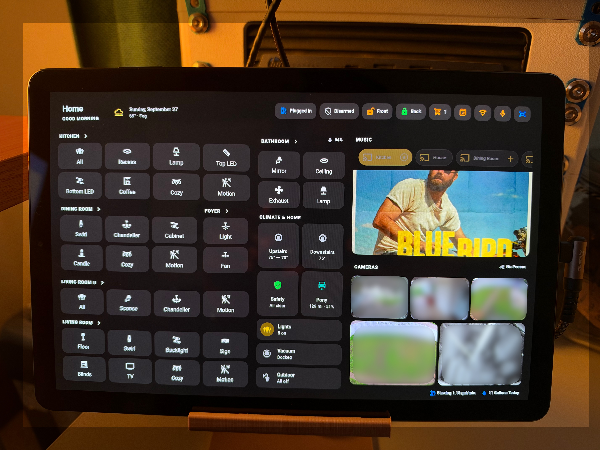
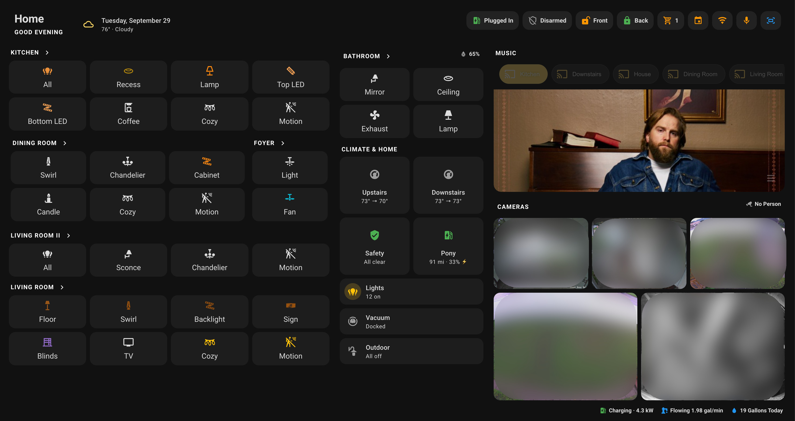
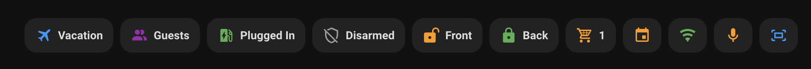
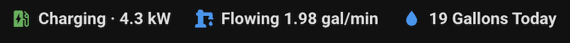

# 🏠 HA Dashboard - Minimalist Tablet UI

Welcome! 👋 This is the new version of my Home Assistant tablet dashboard. I rebuilt the whole thing to be cleaner, fit everything on one screen and still give you full control of the house without digging through a bunch of pages.

A lot of you asked for it so here it is. Hope it helps with your own setup or at least gives you some ideas!

---

## 📸 Screenshots

**Tablet View**
This is how it looks on my Samsung Galaxy Tab S4 mounted on the wall

**Laptop View**
This is how it looks from my laptop

---

## 🎯 Key Features

- Everything on one screen, split into 3 columns: rooms on the left, status in the middle, music and cameras on the right
- Built for touch and tablets but it also works on your phone, anything under 760px wide stacks into a single column
- Greeting changes with the time of day (Good Morning, Good Afternoon, Good Evening)
- Date and current weather with an icon that changes based on the conditions
- Tap a room name to turn off everything in that room
- Tap a button to toggle it, hold it to open a popup with brightness, color and more
- Motion override buttons turn red when active so you know motion automations are paused in that room
- Cozy buttons for each room to trigger my cozy lighting scenes
- Climate cards change icon and color when heating, cooling or running the fan
- Safety card shows All clear or tells you if there is a leak or smoke
- Car card shows range, battery and a ⚡ when charging
- Lights card shows how many lights are on, hold it to turn every light off
- Popups auto close after 5 minutes so the tablet always goes back to the main screen

---

## 🔔 Top Right: Quick Toggles and Notification Center

The top right chips are how I control the most used stuff in the house but they also work as a notification center. Some chips are always there and some only show up when something needs your attention.

**Only shows up when needed**
- ✈️ **Vacation** shows when vacation mode is on, hold to turn it off
- 👥 **Guests** shows when guest mode is on, hold to turn it off
- 🗑️ **Trash Day** shows in green when it's trash day
- ⏰ **Trash Soon** shows in orange when the trash window is closing soon
- 🔌 **Plugged In** shows when the car is plugged in, green if charging and blue if it's just plugged in

**Always there**
- 🛡️ **Alarm** shows the current Alarmo state, tap it to open the alarm popup
- 🔒 **Front** and **Back** show the lock status, green when locked, orange when unlocked and red when the door is open. Tap to open the door popup with the camera, hold to lock or unlock
- 🛒 **Shopping List** shows how many items are on the list and turns orange when there is something on it, tap to open the list
- 📅 **Calendar** opens the calendar popup
- 📶 **Guest Wi-Fi** opens a popup with the guest Wi-Fi QR code, turns green when guest mode is on
- 🎤 **Assist** starts listening right away so you can talk to Home Assistant
- 🖥️ **Kiosk Mode** toggles kiosk mode on and off, blue when on. Kiosk mode hides the header, sidebar and the menu so the tablet looks clean

> ⚠️ **About the kiosk mode chip:** I keep it there so I can get out of kiosk mode easily while I work on the dashboard. If you are putting this on a wall tablet for everyone to use you should remove that chip when you deploy it so people are not able to exit the kiosk.

---

## 📷 Bottom Right: Under the Cameras

Same idea as the top right, the chips under the cameras also work as notifications.

- ⚡ **Charging** only shows up when the car is charging and shows how many kW it's pulling
- 💧 **Flowing** only shows up when water is running and shows the flow rate
- 🚰 **Water Today** always shows how many gallons we used today, turns blue when water is flowing. Tap it to open the water usage popup

The Cameras title also has a chip next to it that shows **No Person** or tells you exactly where someone was detected, like Person @ Front Door & Back Yard.

---

## 🪟 Popups

All popups are made with Bubble Card and open in the center of the screen. Here are the ones I have:

- **Lights** for each light with brightness, color temp and color when the light supports it
- **Foyer Fan** with speed and direction
- **Living Room Blinds** with position and open and close buttons
- **Upstairs and Downstairs Climate** with the full thermostat, modes and fan modes
- **Alarm** with the Alarmo keypad to arm and disarm
- **Front Door and Back Door** with the camera, if the door is open or closed, lock status and when it last changed and a lock button
- **Shopping List** so you can add and check off items right from the tablet
- **Calendar** with the next 7 days, weather on each event and the trash day status plus when the trash was last taken out
- **Guest Wi-Fi** with the QR code, it only shows when guest mode is on and someone is home, if guest mode is off it tells you to turn it on first
- **Outdoor Lights** with all the outside lights and floodlights, tap the title to turn them all off
- **Cleaning** with the vacuum controls
- **Pony** (my car) with charging status, windows, range, battery, 12V battery and odometer
- **Water Usage** with a graph of the last 30 days
- **Leak and Smoke** with every water leak sensor and every smoke and CO sensor in the house

---

## 🧩 Dependencies

Everything below can be installed from HACS. Make sure you have all of them or the dashboard will show errors.

**Cards**
- [Mushroom](https://github.com/piitaya/lovelace-mushroom)
- [Bubble Card](https://github.com/Clooos/Bubble-Card)
- [layout-card](https://github.com/thomasloven/lovelace-layout-card)
- [card-mod](https://github.com/thomasloven/lovelace-card-mod)
- [Kiosk Mode](https://github.com/NemesisRE/kiosk-mode)
- [Yet Another Media Player](https://github.com/jianyu-li/yet-another-media-player)
- [Calendar Card Pro](https://github.com/alexpfau/calendar-card-pro)
- [Vacuum Card](https://github.com/denysdovhan/vacuum-card)
- [Alarmo Card](https://github.com/nielsfaber/alarmo-card)
- [mini-graph-card](https://github.com/kalkih/mini-graph-card)
- [Custom Brand Icons](https://github.com/elax46/custom-brand-icons) for the phu icons

**Integrations I use**
- [Alarmo](https://github.com/nielsfaber/alarmo) for the alarm
- [FordPass](https://github.com/marq24/ha-fordpass) for the car
- [Music Assistant](https://music-assistant.io) for the speakers
- Droplet for the water usage

You don't need all the integrations, if you don't have something just remove that card or swap it for something you do have.

**Helpers**
You will also need to create your own helpers or swap them for yours. The main ones are the input booleans for kiosk mode, vacation mode, guest mode, the cozy buttons and the motion overrides plus the trash sensors and the lights on counter.

---

## 🛠️ How to Use

1. Download **tablet.yaml** or just copy everything in it
2. In Home Assistant go to Settings > Dashboards and create a new dashboard
3. Open the new dashboard, click the pencil to edit, then the 3 dots and pick Raw configuration editor
4. Paste the content and save
5. Make sure all the dependencies above are installed or the cards will not load
6. Edit it however you want, swap my entities for yours, change the rooms, colors, all of it

A few things to keep in mind:
- The background image, the guest Wi-Fi QR code and the theme (Richard) are mine so they won't exist on your setup. Upload your own images and change the theme to whatever you use
- My entity names will not match yours so go through and replace them
- If you are putting it on a wall tablet remember to remove the kiosk mode chip

---

## 🙌 Show Off Your Dashboard

If you use this or build something from it I would love to see it! Open a discussion and share your dashboard so others can get ideas too.

---

## ☕ Support My Work

If you find this dashboard useful and want to support what I'm doing, feel free to [**buy me a coffee**](https://buymeacoffee.com/richardbmh). I really appreciate it!

> 💬 Feedback or questions? Feel free to open an issue or start a discussion.